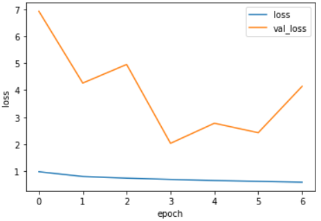
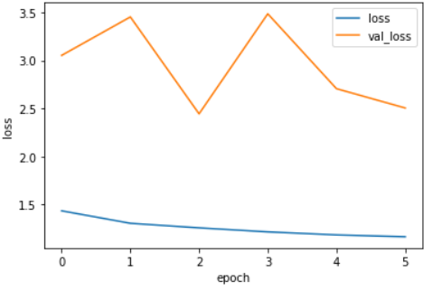
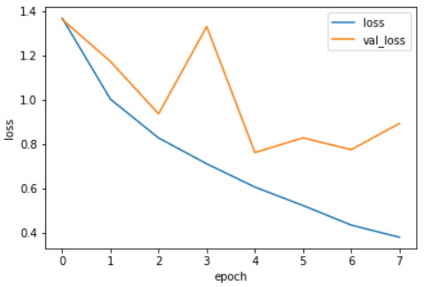
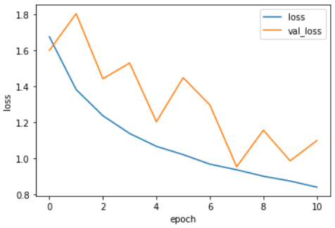
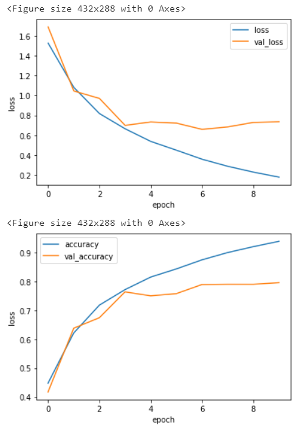
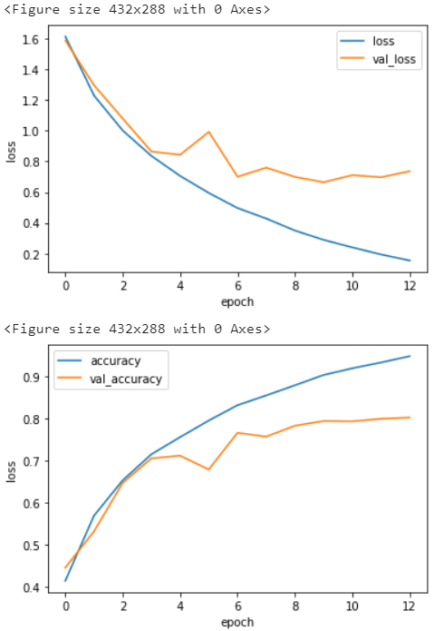
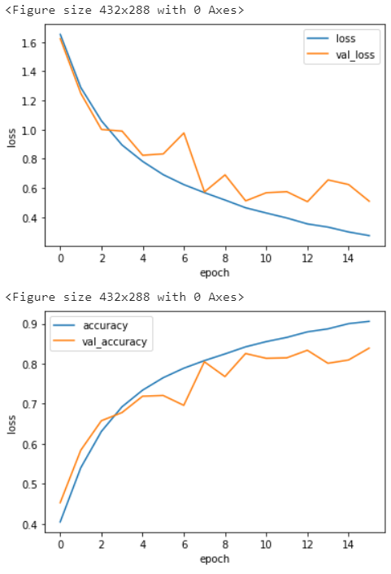
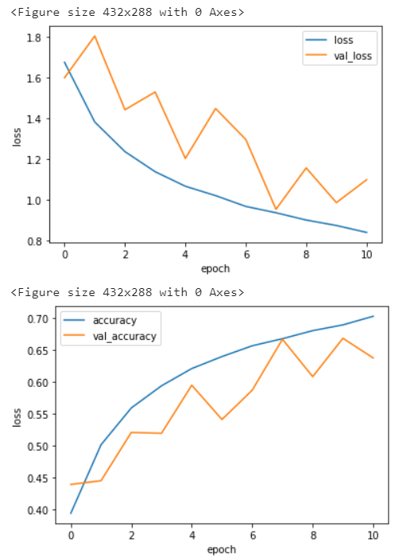
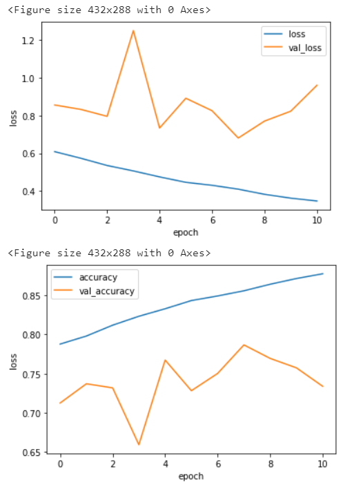

## 概要
このレポートでは、以下について報告する。
1. オートエンコーダ(以下AE)のモデル
2. AEから特徴量を抽出した後に連結した畳み込み分類モデル(以下CNN)
3. 不均衡データに対する施策
4. データ拡張手法
5. まとめ
6. 実験結果のサマライズ

また、それぞれの項目では実験のjupyter notebook名を記載している。

## 1. AEモデル
特徴量抽出のため、単一のAEとAEを3つ重ねたStacked AEを作成した。
- 単一AEとStacked AEのハイパーパラメータ最適化
- 単一AEとStacked AEの特徴量抽出のCNN結合モデルの性能: 

### 1.1. 単一AEとStacked AEのハイパーパラメータ最適化: `AEs_2_Train_001`, `StackAE_Train_001`
単一AEに対して、ハイパーパラメータ探索を行った。
最適化したパラメータと候補は
- カーネルサイズ: `3, 5, 7`
- 最適化関数: `Adam, Rmsprop, SDG`
である。

単一AEのモデル構造は以下の通りである。  
以下`AE`とする。

```python
# AE
def create_AE01_model(k_size):
    input_img = Input(shape=(32, 32, 3))  # 0
    conv1 = Conv2D(64, (k_size, k_size), padding='same', name="Dense_AE01_1")(input_img) # 1
    conv1 = BatchNormalization(name="BN_AE01_1")(conv1) # 2
    conv1 = Activation('relu', name="Relu_AE01_1")(conv1) # 3
        
    decoded = Conv2D(3, (k_size, k_size), padding='same', name="Dense_AE01_2")(conv1) # 4
    decoded = BatchNormalization(name="BN_AE01_2")(decoded) # 5
    decoded = Activation('relu', name="Relu_AE01_2")(decoded) # 6
    return Model(input_img, decoded)
```

OSSのOptunaを用いて、10エポックで5回探索し、validation lossが最も小さくなるように探索を行った。  
結果、カーネルサイズ`3`、最適化関数が`Rmsprop`の際にvalidation lossが小さくなることがわかったので、パラメータにセットし、学習、重みを保存した。  
この重みを利用してエンコーダとして特徴量抽出を行い、2層、3層のStacked AEの学習に利用する。

2層目と、3層目のAEに対しては単一AEで探索したカーネルサイズ3と、最適化関数Rmspropを使用し学習した。  

その後、3層のStacked AEに学習した重みからファインチューニングを行い、ハイパーパラメータ探索を行った。
最適化したパラメータと候補は
- バッチサイズ: `32, 64, 128`
- 最適化関数: `Adam, Rmsprop, SDG`
である。

3層のStacked AEのモデル構造は以下の通りである。  
以下`Stacked AE`とする。

```python
# Stacked AE
def create_StackedAE01_model(k_size):
    # AE 01 encode
    input_img = Input(shape=(32, 32, 3))  # 0; 32*32*3
    conv1 = Conv2D(64, (k_size, k_size), padding='same', name="Dense_AE01_1")(input_img) # 1; 32*32*64
    conv1 = BatchNormalization(name="BN_AE01_1")(conv1) # 2
    conv1 = Activation('relu', name="Relu_AE01_1")(conv1) # 3

    # AE 02 encode
    conv2 = Conv2D(128, (k_size, k_size), padding='same', name="Dense_AE02_1")(conv1) # 4; 32*32*128
    conv2 = BatchNormalization(name="BN_AE02_1")(conv2) # 5
    conv2 = Activation('relu', name="Relu_AE02_1")(conv2) # 6
    pool1 = MaxPooling2D(name="Pool_AE02_1")(conv2)  # 7; 16*16*128

    # AE 03 encode
    conv3 = Conv2D(256, (k_size, k_size), padding='same', name="Dense_AE03_1")(pool1) # 8; 16*16*256
    conv3 = BatchNormalization(name="BN_AE03_1")(conv3) # 9
    conv3 = Activation('relu', name="Relu_AE03_1")(conv3) # 10
    pool2 = MaxPooling2D(name="Pool_AE03_1")(conv3)  # 11; 8*8*256

    # AE 03 decode
    unpool1 = UpSampling2D(name="Unpool_AE03_1")(pool2)  # 12; 16*16*256
    conv4 = Conv2D(128, (k_size, k_size), padding='same', name="Dense_AE03_2")(unpool1) # 13; 16*16*128
    conv4 = BatchNormalization(name="BN_AE03_2")(conv4) # 14
    conv4 = Activation('relu', name="Relu_AE03_2")(conv4) # 15

    # AE 02 decode 
    unpool2 = UpSampling2D(name="Unpool_AE02_1")(conv4)  # 16; 32*32*128
    conv5 = Conv2D(64, (k_size, k_size), padding='same', name="Dense_AE02_2")(unpool2) # 17; 32*32*64
    conv5 = BatchNormalization(name="BN_AE02_2")(conv5) # 18
    conv5 = Activation('relu', name="Relu_AE02_2")(conv5) # 19

    # AE 01 decode
    decoded = Conv2D(3, (k_size, k_size), padding='same', name="Dense_AE01_2")(conv5) # 20; 32*32*3
    decoded = BatchNormalization(name="BN_AE01_2")(decoded) # 21
    decoded = Activation('relu', name="Relu_AE01_2")(decoded) # 22

    return Model(input_img, decoded)
```

Optunaを用いて、10エポックで10回探索し、validation lossが最も小さくなるように探索を行った。  
結果、バッチサイズが`32`、最適化関数が`Rmsprop`の際にvalidation lossが小さくなることがわかったので、パラメータにセットし、学習、重みを保存した。  
この重みを利用してエンコーダとして特徴量抽出に利用する。

### 1.2. Stacked AEと単一AEの特徴量抽出のCNN結合モデルの性能: `StackAE_2_CNN_001`, `AE_2_CNN_002`

特徴量抽出後に接続するCNN(以下CNN 1)の構造は以下である。  
以下`CNN 1`とする。

```python
# CNN 1
def create_StackedAE01_CNN01_model(encoder):
    input_img = encoder.input
    output = encoder.layers[-1].output # 8,8,256
    x = Conv2D(512,(3,3),padding = "same",activation= "relu")(output)
    x = Conv2D(512,(3,3),padding = "same",activation= "relu")(x)
    x = GlobalAveragePooling2D()(x)
    x = Dense(1024)(x)
    x = BatchNormalization()(x)
    x = Activation("relu")(x)
    y = Dense(10,activation = "softmax")(x)

    return Model(input_img, y)
```

実験のパターンは、
- ① Stacked AE + CNN 1
- ② Stacked AE + CNN 1 + Data Augmentation
- ③ AE + CNN 1
- ④ AE + CNN 1 + Data Autumentation 

である。

学習時のパラメータ全てのパターンで以下の値を適用。
- バッチサイズ32
- エポック数400(早期終了あり)
- 最適化関数はAdamのデフォルト設定

学習と評価データの分け方は層状分割(stratify)にしており、学習・評価データ共にクラス数は同じ分布に設定している。

データ拡張の手法は、`回転10度`,`シアー変換0.2`, `平行フリップ`, `垂直フリップ`, `幅シフト0.1(3.2pix)`, `高さシフト0.1(3.2pix)`, `ズーム0.1`, `チャネルシフト0.2`を適用した。  
以下このデータ拡張パターンを`Aug 1`とする。

Staked AEで実験した場合、データ拡張ありとなし関わらず、Accuracy・マクロF1スコアが低くなった。  
学習時のLOSSの推移を確認しても、学習データと評価データでLOSSの下がり方が異なり、学習データに過学習していると考えられる。  
cifar-10のデータでは、Stacked AEのエンコーダによる特徴量抽出は単一のAEのエンコーダを利用した場合より、モデルとして適していなかった。  
Stacked AEはResNetの登場以前では、勾配消失を防ぐ役割として研究が進められており、もっと大きなデータセットでは効果が見られた可能性がある。

#### 実験結果
| experiment                | accuracy | macro f1 | macro minority f1 | 
| ------------------------- | -------- | -------- | ----------------- | 
| ①　Stack AE + CNN 1          | 47       | 43       | 44                | 
| ②　Stack AE + CNN 1 +  Aug 1 | 38       | 29       | 32                | 
| ③　AE + CNN 1                | 71       | 70       | 66                | 
| ③　AE + CNN 1 + CV           | 70       | 68       | -                 | 
| ④　AE + CNN 1 +  Aug 1       | 67       | 66       | 60                | 
| ④　AE + CNN 1 +  Aug 1 + CV  | 76       | 74       | -                 | 
|                         | 
|                         | 

#### 学習時のLOSSの推移

①　Stacked AE + CNN 1




②　Stacked AE + CNN 1 + Aug 1



③　AE + CNN 1



④　AE + CNN 1 + Aug 1




## 2. CNNモデル
以下について報告する。
- 作成したモデル
- モデルのハイパーパラメータ最適化

### 2.1. 作成したモデル: `AE_2_CNN_012`
AEで特徴量抽出後のモデルは主に4つ作成し、性能を比較し適切なモデルを探索した。
- AE + CNN 1: 単一AE(1層)+CNN(3層)+全結合(2層)の6層モデル
- AE + CNN 2: 単一AE(1層)+CNN(9層)+全結合(2層)の12層モデル
- AE + CNN 3: 単一AE(1層)+CNN(12層)+全結合(2層)の15層モデル
- AE + CNN 4: 単一AE(1層)+CNN(13層)+全結合(2層)のResNetベースの16層モデル

それぞれのCNNのモデル構造は以下の通りである。

```python
# CNN 1
def create_StackedAE01_CNN01_model(encoder):
    input_img = encoder.input
    output = encoder.layers[-1].output # 8,8,256
    x = Conv2D(512,(3,3),padding = "same",activation= "relu")(output)
    x = Conv2D(512,(3,3),padding = "same",activation= "relu")(x)
    x = GlobalAveragePooling2D()(x)
    x = Dense(1024)(x)
    x = BatchNormalization()(x)
    x = Activation("relu")(x)
    y = Dense(10,activation = "softmax")(x)

    return Model(input_img, y)

# CNN 2
def create_StackedAE01_CNN01_model(encoder):
    input_img = encoder.input
    output = encoder.layers[-1].output # 32,32,64
    x = Conv2D(64,(3,3),padding = "same",activation= "relu")(output) # 2
    x = BatchNormalization()(x)
    x = Activation('relu')(x)
    x = Conv2D(64,(3,3),padding = "same",activation= "relu")(x) # 3
    x = BatchNormalization()(x)
    x = Activation('relu')(x)
    x = Conv2D(64,(3,3),padding = "same",activation= "relu")(x) # 4
    x = BatchNormalization()(x)
    x = Activation('relu')(x)
    x = MaxPooling2D(pool_size=(2, 2))(x) # 16,16,64
    
    x = Conv2D(128,(3,3),padding = "same",activation= "relu")(x) # 5
    x = BatchNormalization()(x)
    x = Activation('relu')(x)
    x = Conv2D(128,(3,3),padding = "same",activation= "relu")(x) # 6
    x = BatchNormalization()(x)
    x = Activation('relu')(x)
    x = Conv2D(128,(3,3),padding = "same",activation= "relu")(x) # 7
    x = BatchNormalization()(x)
    x = Activation('relu')(x)
    x = MaxPooling2D(pool_size=(2, 2))(x) # 8,8,128

    x = Conv2D(256,(3,3),padding = "same",activation= "relu")(x) # 8
    x = BatchNormalization()(x)
    x = Activation('relu')(x)
    x = Conv2D(256,(3,3),padding = "same",activation= "relu")(x) # 9
    x = BatchNormalization()(x)
    x = Activation('relu')(x)
    x = Conv2D(256,(3,3),padding = "same",activation= "relu")(x) # 10
    x = BatchNormalization()(x)
    x = Activation('relu')(x)
    
    x = GlobalAveragePooling2D()(x)
    x = Dense(256)(x) # 11
    x = BatchNormalization()(x)
    x = Activation("relu")(x)
    y = Dense(10,activation = "softmax")(x) # 12

    return Model(input_img, y)

# CNN 3
def create_StackedAE01_CNN03_model(encoder):
    input_img = encoder.input
    output = encoder.layers[-1].output # 32,32,64
    x = Conv2D(64,(3,3),padding = "same",activation= "relu")(output) # 2
    x = BatchNormalization()(x)
    x = Activation('relu')(x)
    x = Conv2D(64,(3,3),padding = "same",activation= "relu")(x) # 3
    x = BatchNormalization()(x)
    x = Activation('relu')(x)
    x = Conv2D(64,(3,3),padding = "same",activation= "relu")(x) # 4
    x = BatchNormalization()(x)
    x = Activation('relu')(x)
    x = MaxPooling2D(pool_size=(2, 2))(x) # 16,16,64
    
    x = Conv2D(128,(3,3),padding = "same",activation= "relu")(x) # 5
    x = BatchNormalization()(x)
    x = Activation('relu')(x)
    x = Conv2D(128,(3,3),padding = "same",activation= "relu")(x) # 6
    x = BatchNormalization()(x)
    x = Activation('relu')(x)
    x = Conv2D(128,(3,3),padding = "same",activation= "relu")(x) # 7
    x = BatchNormalization()(x)
    x = Activation('relu')(x)
    x = MaxPooling2D(pool_size=(2, 2))(x) # 8,8,128

    x = Conv2D(256,(3,3),padding = "same",activation= "relu")(x) # 8
    x = BatchNormalization()(x)
    x = Activation('relu')(x)
    x = Conv2D(256,(3,3),padding = "same",activation= "relu")(x) # 9
    x = BatchNormalization()(x)
    x = Activation('relu')(x)
    x = Conv2D(256,(3,3),padding = "same",activation= "relu")(x) # 10
    x = BatchNormalization()(x)
    x = Activation('relu')(x)
    x = Conv2D(512,(3,3),padding = "same",activation= "relu")(x) # 11
    x = BatchNormalization()(x)
    x = Activation('relu')(x)
    x = Conv2D(512,(3,3),padding = "same",activation= "relu")(x) # 12
    x = BatchNormalization()(x)
    x = Activation('relu')(x)
    x = Conv2D(512,(3,3),padding = "same",activation= "relu")(x) # 13
    x = BatchNormalization()(x)
    x = Activation('relu')(x)
    x = MaxPooling2D(pool_size=(2, 2))(x) # 4,4,256
    
    x = GlobalAveragePooling2D()(x)
    x = Dense(256)(x) # 14
    x = BatchNormalization()(x)
    x = Activation("relu")(x)
    y = Dense(10,activation = "softmax")(x) # 15

    return Model(input_img, y)

# CNN 4
def create_StackedAE01_CNN04_model(encoder):
    input_img = encoder.input
    output = encoder.layers[-1].output # 32,32,64
    x = Conv2D(64,(5,5),padding = "same",activation= "relu")(output) # 2
    x = BatchNormalization()(x)
    x = Activation('relu')(x)
    x1 = MaxPooling2D(pool_size=(2, 2))(x) # 16,16,64
    
    x2 = Conv2D(64,(3,3),padding = "same",activation= "relu")(x1) # 3
    x2 = BatchNormalization()(x2)
    x2 = Activation('relu')(x2)
    x2 = Conv2D(64,(3,3),padding = "same",activation= "relu")(x2) # 4
    x2 = BatchNormalization()(x2)
    x2 = Activation('relu')(x2)
    
    x3 = Add()([x1, x2])
    
    x4 = Conv2D(64,(3,3),padding = "same",activation= "relu")(x3) # 5
    x4 = BatchNormalization()(x4)
    x4 = Activation('relu')(x4)
    x4 = Conv2D(64,(3,3),padding = "same",activation= "relu")(x4) # 6
    x4 = BatchNormalization()(x4)
    x4 = Activation('relu')(x4)
    
    x5 = Add()([x3, x4])

    x6 = Conv2D(128,(3,3),padding = "same",activation= "relu")(x5) # 7
    x6 = BatchNormalization()(x6)
    x6 = Activation('relu')(x6)
    x6 = Conv2D(128,(3,3),padding = "same",activation= "relu")(x6) # 8
    x6 = BatchNormalization()(x6)
    x6 = Activation('relu')(x6)
    
    x5 = Conv2D(128,(1,1),padding = "same",activation= "relu")(x6)
    x7 = Add()([x5, x6])
               
    x8 = Conv2D(128,(3,3),padding = "same",activation= "relu")(x7) # 9
    x8 = BatchNormalization()(x8)
    x8 = Activation('relu')(x8)
    x8 = Conv2D(128,(3,3),padding = "same",activation= "relu")(x8) # 10
    x8 = BatchNormalization()(x8)
    x8 = Activation('relu')(x8)
    
    x9 = Add()([x7, x8])
               
    x10 = Conv2D(256,(3,3),padding = "same",activation= "relu")(x9) # 11
    x10 = BatchNormalization()(x10)
    x10 = Activation('relu')(x10)
    x10 = Conv2D(256,(3,3),padding = "same",activation= "relu")(x10) # 12
    x10 = BatchNormalization()(x10)
    x10 = Activation('relu')(x10)
    
    x9 = Conv2D(256,(1,1),padding = "same",activation= "relu")(x9)
    x11 = Add()([x9, x10])
    
    x12 = Conv2D(256,(3,3),padding = "same",activation= "relu")(x11) # 13
    x12 = BatchNormalization()(x12)
    x12 = Activation('relu')(x12)
    x12 = Conv2D(256,(3,3),padding = "same",activation= "relu")(x12) # 14
    x12 = BatchNormalization()(x12)
    x12 = Activation('relu')(x12)
                
    x13 = Add()([x11, x12])
    x13 = MaxPooling2D(pool_size=(2, 2))(x13) # 8, 8 256         
    x13 = GlobalAveragePooling2D()(x13)
    x14 = Dense(256)(x13) # 15
    x14 = BatchNormalization()(x14)
    x14 = Activation("relu")(x14)
    y = Dense(10,activation = "softmax")(x14) # 16

    return Model(input_img, y)
```

実験結果の表を確認すると、①のAE+CNN1以外は平均するとそれほど変化はない。  
しかし、少数データのbirdクラスのf1スコアの値が②のAE+CNN2以外は、70を下回っている。  
また、学習時の推移を確認すると、④のAE+CNN3のresnetベースのモデルは、評価データでは80%以上のaccuracyに到達している。  
しかし、実際のテストデータは不均衡データであり、80%を超えてはおらず過学習気味であることが確認できる。
②のAE+CNN2と③のAE+CNN3を比較すると、実験結果自体は平均するとほぼ同等であるが、③は②に比べて4倍のパラメータ数を保有しており、学習エポック数も②よりも多くを必要とする。
以上から、cifar-10の不均衡データに対して、実験結果・学習スピードから適切なモデルは②のAE+CNN2であると判断した。


#### 実験結果
| experiment | accuracy | macro f1 | macro minority f1 | bird f1 | deer f1 | truck f1 | 
| ---------- | -------- | -------- | ----------------- | ------- | ------- | -------- | 
| ①　AE + CNN 1 | 71       | 70       | 66                | 54      | 65      | 78       | 
| ②　AE + CNN 2 | 78       | 78       | 74                | 70      | 70      | 81       | 
| ③　AE + CNN 3 | 78       | 78       | 76                | 65      | 75      | 87       | 
| ④　AE + CNN 4 | 75       | 75       | 75                | 68      | 74      | 82       | 
|            | 
|            | 

#### 学習時の推移
②　AE + CNN 2




③　AE + CNN 3




④　AE + CNN 4



### 2.2. モデルのハイパーパラメータ最適化: `AE_2_CNN_013`
ハイパーパラメータ最適化では精度が十分であると考えられたモデル(AE + CNN 2)のパラメータの最適化を行った。
最適化したパラメータと候補は
- バッチサイズ: `32, 64, 128`
- 最適化関数: `Adam, Rmsprop, SDG`
である。  

OSSのOptunaを用いて、10エポックで10回validation lossが最も小さくなるように探索を行った。  
結果、バッチサイズ`64`、最適化関数が`Adam`の際にvalidation lossが小さくなることがわかったので、実験を行った。

結果は以下のようである。  
macro minority F1は不均衡データ対象の鳥、鹿、トラックのF1スコアの平均を表している。  
バッチサイズ最適化は今回の場合、効果が薄かったようである。

| experiment                                            | accuracy | macro f1 | macro minority f1 | 
| ----------------------------------------------------- | -------- | -------- | ----------------- | 
| AE + CNN 2 + Batchsize32                              | 78       | 78       | 74                | 
| AE + CNN 2 + Aug 2 + Batchsize64(params optimization) | 77       | 77       | 73                | 
|                         | 
|                         | 


## 3. 不均衡データに対する施策
今回の課題では学習画像が10クラスそれぞれ5000枚存在しているが、鳥・鹿・トラックの3分類が学習画像では2500枚とその他のクラスの半分になっており、不均衡状態である。  
不均衡データに対する施策は
- アンダーサンプリング
- オーバーサンプリング
- オーバーサンプリング(SMOTE)
- クラス重み付け
- Out of fold 予測; 交差検証(Cross validation: CV)時にモデルを作成しアンサンブル  

であり、それぞれについて報告する。

## 4. データ拡張手法
データ拡張手法では、
- AE + CNN 1での比較
- AE + CNN 2での比較
を行った。

### 4.1. AE + CNN 1での比較: `AE_2_CNN_002`
比較するデータ拡張は、2パターンである。
- Aug 1: `回転10度`,`シアー変換0.2`, `平行フリップ`, `垂直フリップ`, `幅シフト3.2pix`, `高さシフト3.2pix`, `ズーム0.1`, `チャネルシフト0.2`
- Aug 2: `水平フリップ`, `ズーム0.1`

以下でAug 1, Aug 2とする。

Aug 1とAug 2では数値ではそれほど、違いは見られなかった。  
しかし、学習時の推移を確認すると、①AE+CNN1+Aug1+CVと②AE+CNN1+Aug2+CVで明らかに、学習推移が異なる。  
①の方が徐々にlossが低下しているため、①を率先して使用しようと考えたが、データ拡張手法の中で明らかにaccuracyを下げるような拡張手法が存在していると考えられ、lossが②に比べると高い値になっている。  
今回の課題ではlossとaccuracyから判断して、Aug 2が良いと考える。


#### 実験結果
| experiment  | accuracy | macro f1 | 
| ---------------- | -------- | -------- |
| ①　AE + CNN 1 +  Aug 1 + CV | 76  | 74  | 
| ②　AE + CNN 1 +  Aug 2 + CV | 78  | 76  | 
|                         | 
|                         | 

#### 学習時の推移
①　AE + CNN 1 +  Aug 1 + CV



②　AE + CNN 1 +  Aug 2 + CV




### 4.2. AE + CNN 2での比較: `AE_2_CNN_014`, `AE_2_CNN_015`
比較するデータ拡張は、3パターンである。
- Aug 2: `水平フリップ`, `ズーム0.1`
- Aug 3: `Mix up`, `水平フリップ`, `ズーム0.1`
- Aug 4: `幅シフト4pix`, `高さシフト4pix`, `水平フリップ`, `ズーム0.1`

以下でAug 1, Aug 3, Aug 4とする。

Aug 2, Aug 3, Aug 4もCNN1のデータ拡張手法の実験同様、値に大きな差は見られなかった。  
③のAug 3で使用されたMix upは、通常の学習時間の倍ほどかかったので、上手く使用するのが難しいと感じた。  
また④のAug 4では、CNN1のデータ拡張手法の実験で垂直フリップ(垂直フリップのデータがそれほどないから)がモデルの精度を低くしていると考え、Aug 1から外し、Aug 2にシフト移動のデータ拡張を加えた。  
実験結果と学習サイクルを考え、Aug 2が良いと考える。


#### 実験結果

| experiment              | accuracy | macro f1 | 
| ----------------------- | -------- | -------- | 
| ①　AE + CNN 2 + Aug 2 + CV | 83       | 87       | 
| ②　AE + CNN 2 + Aug 3 + CV | 84       | 83       | 
| ③　AE + CNN 2 + Aug 4 + CV | 83       | 82       | 
|                         | 
|                         | 

## 5. まとめ


## 6. 実験結果サマライズ
#### 実験結果一覧

| index | experiment                                  | accuracy | macro f1 | macro minority f1 | bird f1 | deer f1 | truck f1 | notebook name     | 
| ----- | ------------------------------------------- | -------- | -------- | ----------------- | ------- | ------- | -------- | ----------------- | 
| 1     | Stack AE + CNN 1                            | 47       | 43       | 44                | 36      | 18      | 77       | StackAE_2_CNN_001 | 
| 2     | Stack AE + CNN 1 +  Aug 1                   | 38       | 29       | 32                | 1       | 41      | 55       | StackAE_2_CNN_001 | 
| 3     | AE + CNN 1                                  | 71       | 70       | 66                | 54      | 65      | 78       | AE_2_CNN_002      | 
| 4     | AE + CNN 1 + CV                             | 70       | 68       | -                 | -       | -       | -        | AE_2_CNN_004      | 
| 5     | AE + CNN 1 +  Aug 1                         | 67       | 66       | 60                | 46      | 57      | 76       | AE_2_CNN_002      | 
| 6     | AE + CNN 1 +  Aug 1 + CV                    | 76       | 74       | -                 | -       | -       | -        | AE_2_CNN_004      | 
| 7     | AE + CNN 1 +  Aug 2                         | 79       | 78       | 75                | 63      | 76      | 86       | AE_2_CNN_002      | 
| 8     | AE + CNN 1 +  Aug 2 + CV                    | 78       | 76       | -                 | -       | -       | -        | AE_2_CNN_004      | 
| 9     | AE + CNN 1 + OOF                            | 78       | 78       | 73                | 62      | 74      | 84       | AE_2_CNN_004      | 
| 10    | AE + CNN 1 +  Aug 1 + OOF                   | 74       | 74       | 70                | 62      | 65      | 83       | AE_2_CNN_004      | 
| 11    | AE + CNN 1 +  Aug 2 + OOF                   | 82       | 82       | 79                | 71      | 77      | 88       | AE_2_CNN_004      | 
| 12    | AE + CNN 1 + UnderSamp                      | 68       | 68       | 65                | 56      | 65      | 75       | AE_2_CNN_003      | 
| 13    | AE + CNN 1 + UnderSamp + CV                 | 76       | 75       | -                 | -       | -       | -        | AE_2_CNN_007      | 
| 14    | AE + CNN 1 + UnderSamp + Aug 2              | 73       | 74       | 72                | 65      | 67      | 83       | AE_2_CNN_003      | 
| 15    | AE + CNN 1 + UnderSamp + Aug 2  + CV        | 74       | 72       | -                 | -       | -       | -        | AE_2_CNN_007      | 
| 16    | AE + CNN 1 + UnderSamp + OOF                | 76       | 76       | 74                | 65      | 71      | 85       | AE_2_CNN_007      | 
| 17    | AE + CNN 1 + UnderSamp + Aug 2  + OOF       | 78       | 77       | 76                | 69      | 75      | 85       | AE_2_CNN_007      | 
| 18    | AE + CNN 1 + ClassWeight                    | 72       | 72       | 71                | 62      | 67      | 83       | AE_2_CNN_005      | 
| 19    | AE + CNN 1 + ClassWeight + CV               | 72       | 71       | -                 | -       | -       | -        | AE_2_CNN_006      | 
| 20    | AE + CNN 1 + ClassWeight+ Aug 2             | 77       | 77       | 73                | 63      | 72      | 85       | AE_2_CNN_005      | 
| 21    | AE + CNN 1 + ClassWeight+ Aug 2 + CV        | 78       | 77       | -                 | -       | -       | -        | AE_2_CNN_006      | 
| 22    | AE + CNN 1 + ClassWeight + OOF              | 78       | 78       | 74                | 67      | 69      | 85       | AE_2_CNN_006      | 
| 23    | AE + CNN 1 + ClassWeight + Aug 2  + OOF     | 81       | 80       | 78                | 71      | 76      | 88       | AE_2_CNN_006      | 
| 24    | AE + CNN 1 + OverSamp                       | 75       | 75       | 73                | 64      | 71      | 83       | AE_2_CNN_008      | 
| 25    | AE + CNN 1 + OverSamp + CV                  | 87       | 87       | -                 | -       | -       | -        | AE_2_CNN_009      | 
| 26    | AE + CNN 1 + OverSamp + Aug 2               | 77       | 77       | 76                | 70      | 72      | 85       | AE_2_CNN_008      | 
| 27    | AE + CNN 1 + OverSamp + Aug 2  + CV         | 79       | 78       | -                 | -       | -       | -        | AE_2_CNN_009      | 
| 28    | AE + CNN 1 + OverSamp + OOF                 | 79       | 79       | 77                | 71      | 75      | 86       | AE_2_CNN_009      | 
| 29    | AE + CNN 1 + OverSamp + Aug 2  + OOF        | 78       | 77       | 76                | 69      | 75      | 85       | AE_2_CNN_009      | 
| 30    | AE + CNN 1 + OverSamp(SMOTE)                | 75       | 75       | 69                | 65      | 68      | 75       | AE_2_CNN_010      | 
| 31    | AE + CNN 1 + OverSamp(SMOTE) + CV           | 73       | 71       | -                 | -       | -       | -        | AE_2_CNN_011      | 
| 32    | AE + CNN 1 + OverSamp(SMOTE) + Aug 2        | 76       | 75       | 74                | 70      | 66      | 85       | AE_2_CNN_010      | 
| 33    | AE + CNN 1 + OverSamp(SMOTE) + Aug 2 + CV   | 76       | 75       | -                 | -       | -       | -        | AE_2_CNN_011      | 
| 34    | AE + CNN 1 + OverSamp(SMOTE) + OOF          | 77       | 77       | 74                | 67      | 74      | 82       | AE_2_CNN_011      | 
| 35    | AE + CNN 1 + OverSamp(SMOTE) + Aug 2  + OOF | 81       | 81       | 78                | 72      | 73      | 88       | AE_2_CNN_011      | 
| 36    | AE + CNN 2                                  | 78       | 78       | 74                | 70      | 70      | 81       | AE_2_CNN_012      | 
| 37    | AE + CNN 2 + CV                             | 80       | 79       | -                 | -       | -       | -        | AE_2_CNN_014      | 
| 38    | AE + CNN 3                                  | 78       | 78       | 76                | 65      | 75      | 87       | AE_2_CNN_012      | 
| 39    | AE + CNN 4                                  | 75       | 75       | 75                | 68      | 74      | 82       | AE_2_CNN_012      | 
| 40    | AE + CNN 2 + Aug 2                          | 80       | 80       | 75                | 66      | 72      | 88       | AE_2_CNN_012      | 
| 41    | AE + CNN 2 + Aug 2 + CV                     | 83       | 87       | -                 | -       | -       | -        | AE_2_CNN_014      | 
| 42    | AE + CNN 2 + Aug 2 + Batchsize64            | 77       | 77       | 73                | 66      | 68      | 86       | AE_2_CNN_013      | 
| 43    | AE + CNN 2 + OOF                    | 82       | 82       | 78                | 69      | 79      | 87       | AE_2_CNN_014      | 
| 44    | AE + CNN 2 + Aug 2 + OOF           | 87       | 87       | 86                | 80      | 85      | 93       | AE_2_CNN_014      | 
| 45  | AE + CNN 2 + Aug 3 + CV              | 84  | 83  | -   | -   | -   | -   | AE_2_CNN_015 | 
| 46  | AE + CNN 2 + Aug 3 + OOF             | 87  | 87  | 86  | 80  | 85  | 92  | AE_2_CNN_015 | 
| 47  | AE + CNN 2 + Aug 4 + CV              | 83  | 82  | -   | -   | -   | -   | AE_2_CNN_015 | 
| 48  | AE + CNN 2 + Aug 4 + OOF             | 86  | 85  | 83  | 75  | 84  | 91  | AE_2_CNN_015 | 
| 49  | AE + CNN 2 + OverSamp + Aug 2  + CV  | 90  | 90  | -   | -   | -   | -   | AE_2_CNN_016 | 
| 50  | AE + CNN 2 + OverSamp + Aug 2  + OOF | 88  | 88  | 86  | 81  | 86  | 92  | AE_2_CNN_016 | 
|     | 
|                         | 
##### 実験レポートの内容
- AEs_Train_001: 
  - 単一AE, 2層Stack AE, 3層Stacked AEモデル作成
  - AEモデル3つに対して、カーネルサイズ、最適化関数のハイパーパラメータ探索
- StackAE_2_CNN_001: 
  - Stack AEを用いて特徴量抽出し、分類モデル作成
  - データ拡張手法(Aug 1)適用
- AE_2_CNN_002: 
  - 単一AEを用いて特徴量抽出し、分類モデル(CNN1)作成
  - データ拡張手法(Aug1, Aug2)適用
- AE_2_CNN_004: 
  - 単一AEを用いて特徴量抽出し、分類モデル(CNN1)作成
  - データ拡張手法(Aug2)適用
  - K-fold(層状K分割)で3つに分け、交差検証評価
  - K-fold(層状K分割)で3つに分けたモデルを用いてOut of fold(OOF)でテストデータを予測し評価
- AE_2_CNN_003: 
  - 単一AEを用いて特徴量抽出し、分類モデル(CNN1)作成
  - データ拡張手法(Aug2)適用
  - アンダーサンプリング適用
- AE_2_CNN_007: 
  - 単一AEを用いて特徴量抽出し、分類モデル(CNN1)作成
  - データ拡張手法(Aug2)適用
  - アンダーサンプリング適用
  - K-fold(層状K分割)で3つに分け、交差検証評価
  - K-fold(層状K分割)で3つに分けたモデルを用いてOut of fold(OOF)でテストデータを予測し評価
- AE_2_CNN_005: 
  - 単一AEを用いて特徴量抽出し、分類モデル(CNN1)作成
  - データ拡張手法(Aug2)適用
  - クラス重み適用
- AE_2_CNN_006: 
  - 単一AEを用いて特徴量抽出し、分類モデル(CNN1)作成
  - データ拡張手法(Aug2)適用
  - クラス重み適用
  - K-fold(層状K分割)で3つに分け、交差検証評価
  - K-fold(層状K分割)で3つに分けたモデルを用いてOut of fold(OOF)でテストデータを予測し評価
- AE_2_CNN_008: 
  - 単一AEを用いて特徴量抽出し、分類モデル(CNN1)作成
  - データ拡張手法(Aug2)適用
  - オーバーサンプリング適用
- AE_2_CNN_009: 
  - 単一AEを用いて特徴量抽出し、分類モデル(CNN1)作成
  - データ拡張手法(Aug2)適用
  - オーバーサンプリング適用
  - K-fold(層状K分割)で3つに分け、交差検証評価
  - K-fold(層状K分割)で3つに分けたモデルを用いてOut of fold(OOF)でテストデータを予測し評価
- AE_2_CNN_010: 
  - 単一AEを用いて特徴量抽出し、分類モデル(CNN1)作成
  - データ拡張手法(Aug2)適用
  - オーバーサンプリング(SMOTE)適用
- AE_2_CNN_011: 
  - 単一AEを用いて特徴量抽出し、分類モデル(CNN1)作成
  - データ拡張手法(Aug2)適用
  - オーバーサンプリング(SMOTE)適用
  - K-fold(層状K分割)で3つに分け、交差検証評価
  - K-fold(層状K分割)で3つに分けたモデルを用いてOut of fold(OOF)でテストデータを予測し評価
- AE_2_CNN_012: 
  - 単一AEを用いて特徴量抽出し、複数の分類モデル(CNN2,CNN3,CNN4)作成し評価
  - CNN2に対してデータ拡張手法(Aug2)適用
- AE_2_CNN_014: 
  - 単一AEを用いて特徴量抽出し、分類モデル(CNN2)作成
  - データ拡張手法(Aug2)適用
  - K-fold(層状K分割)で3つに分け、交差検証評価
  - K-fold(層状K分割)で3つに分けたモデルを用いてOut of fold(OOF)でテストデータを予測し評価
- AE_2_CNN_013: 
  - 単一AEを用いて特徴量抽出し、分類モデル(CNN2)作成
  - バッチサイズ、最低化関数のハイパーパラメータ探索
- AE_2_CNN_015: 
  - 単一AEを用いて特徴量抽出し、分類モデル(CNN2)作成
  - データ拡張手法実験
  - K-fold(層状K分割)で3つに分け、交差検証評価
  - K-fold(層状K分割)で3つに分けたモデルを用いてOut of fold(OOF)でテストデータを予測し評価
- AE_2_CNN_016: 
  - 単一AEを用いて特徴量抽出し、分類モデル(CNN2)作成
  - オーバーサンプリング適用
  - K-fold(層状K分割)で3つに分け、交差検証評価
  - K-fold(層状K分割)で3つに分けたモデルを用いてOut of fold(OOF)でテストデータを予測し評価


## ビルド
This environment is build in Windows(Anaconda) @ Python 3.8.
You make the conda environment and then push below commands:

```
$ python -m pip install --upgrade pip
$ pip install -r requirements.txt
$ conda install jupyter
```
